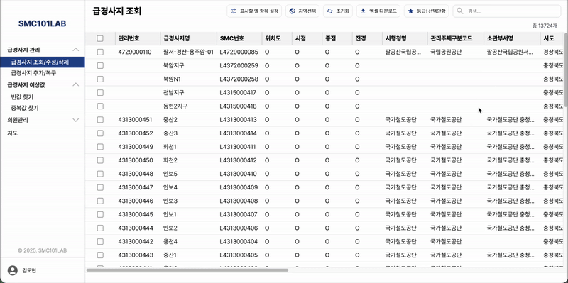
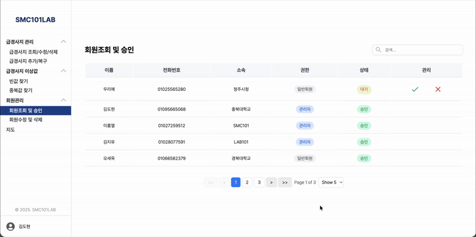

# SMC101LAB: 급경사지 데이터 시각화 프로젝트

  
  
급경사지(산사태·붕괴 위험 지역) 데이터를 체계적으로 관리하고, 현장 기술자 및 관리자가 직관적으로 위험 정보를 확인할 수 있도록 지원하는 지도 기반 위험 관리 웹 서비스입니다.

 

## 📋 프로젝트 개요

**SMC101LAB**은 급경사지(산사태·붕괴 위험 지역) 데이터를 중앙에서 관리하고,  
지도 기반 UI를 통해 현장 기술자와 관리자가 위험 정보를 직관적으로 확인할 수 있도록 설계된  
**통합 급경사지 관리 웹 애플리케이션입니다.**

기존 급경사지 관리 업무는 엑셀 파일과 문서 중심으로 이루어져 있어  
데이터가 여러 곳에 분산되고, 현장에서 즉시 정보를 확인하기 어려운 구조였습니다.  
또한 수작업으로 데이터를 수정·공유하는 과정에서 중복, 누락, 위치 오류 등의 문제가 빈번하게 발생했습니다.

본 프로젝트는 이러한 관리 방식을 개선하기 위해  
급경사지 정보를 하나의 시스템에서 관리하고,  
지도를 중심으로 데이터를 시각화하여 실제 현장 업무 흐름에 맞게 사용할 수 있도록 개발했습니다.

---

### 서비스 구성

- **통합 웹 애플리케이션**
  - 관리자용 PC 환경과 현장 기술자를 위한 모바일 환경을 모두 지원하는 반응형 웹앱
  - 급경사지 데이터 관리, 조회, 엑셀 업로드/다운로드 기능 제공
  - 사용자 위치 기반 현장 정보 확인 지원

단일 백엔드 API를 기반으로 디바이스에 최적화된 UI를 제공하여  
 어디서든 동일한 데이터를 활용할 수 있도록 설계했습니다.

---

### 배포 환경

- **웹 애플리케이션**: https://smc101lab.com
- **모바일 애플리케이션**
  - iOS: App Store
  - Android: Google Play Store

실제 운영 환경을 기준으로 배포되어 있으며,  
 현장 및 사무 환경에서 모두 사용 가능하도록 구성되어 있습니다.

---

### 개발 정보

- **개발 기간**: 2025.02 ~ 2025.08
- **개발 인원**: 1인
- **개발 형태**: 풀스택 개발

## 🛠 기술 스택

### Frontend

- React 18, TypeScript, Vite
- TanStack Query, Zustand
- TanStack Table
- react-naver-maps

### Backend

- Node.js, Express, TypeScript
- MongoDB (Mongoose)
- JWT Authentication
- AWS S3

### Mobile

- React Native (Expo)

### Infrastructure

- AWS
- GitHub Actions (CI/CD)

   

## ✨ 주요 기능

### 1. 로그인 및 급경사지 데이터 조회 / 수정

JWT 기반 로그인 시스템을 적용해 사용자 권한에 따라 기능을 분리했습니다.  
 관리자는 전체 데이터 관리가 가능하며, 현장 사용자는 조회 및 일부 정보 등록만 허용됩니다.

로그인 후 지도 및 테이블 기반으로 급경사지 데이터를 조회할 수 있으며,  
 **무한 스크롤 + 가상 스크롤**을 적용해 대용량 데이터에서도 성능을 유지했습니다.

- 위험 등급·지역 선택·필터 초기화 등 다양한 조건 검색 지원
- 표시할 열 항목 설정 기능 제공
- 사진 등록 및 데이터 수정 가능
- 변경 사항은 API 기반으로 즉시 반영

이를 통해 대량 데이터 환경에서도 빠르고 직관적인 관리가 가능하도록 구현했습니다.

   

  

---

### 2. 검색, 엑셀 연동 및 데이터 검증

급경사지 데이터를 보다 효율적으로 관리할 수 있도록 검색, 엑셀 연동, 데이터 검증 기능을 구현했습니다.

- 키워드 기반 검색으로 원하는 데이터 빠르게 조회
- 엑셀 다운로드 기능을 통해 데이터 백업 및 보고서 활용 지원
- 엑셀 업로드로 대량 급경사지 데이터 일괄 등록 가능
- 이상값 탐지 기능을 통해 **중복 데이터 및 빈 값 자동 식별**

이를 통해 데이터 관리 효율성을 높이고 입력 오류를 최소화했습니다.

   

  

---

### 3. 지도 기반 급경사지 조회

지도 UI를 통해 급경사지 위치를 직관적으로 확인하고 다양한 조건으로 탐색할 수 있도록 구현했습니다.

- 지역, 이름, 관리번호 등 다양한 조건 검색 지원
- 마커 클릭 시 해당 급경사지 상세 정보 확인 가능
- 위험 등급 필터 및 개별 표기(이름 전체 표시) 기능 제공
- 위성지도 전환 기능 지원
- 현장 관리자 사용을 고려한 반응형 설계 적용

이를 통해 현장과 사무 환경 모두에서 빠르고 직관적인 위치 기반 조회가 가능하도록 했습니다.

   

  

---

### 4. 회원 관리

관리자 승인 기반의 회원 인가 시스템을 구축해 허가된 사용자만 서비스에 접근할 수 있도록 설계했습니다.

- 관리자 승인 후 계정 활성화
- 회원 조회, 정보 수정 및 삭제 기능 제공
- 권한 기반 사용자 관리 지원

안전한 사용자 관리를 통해 시스템 보안을 강화했습니다.

   

  

---
